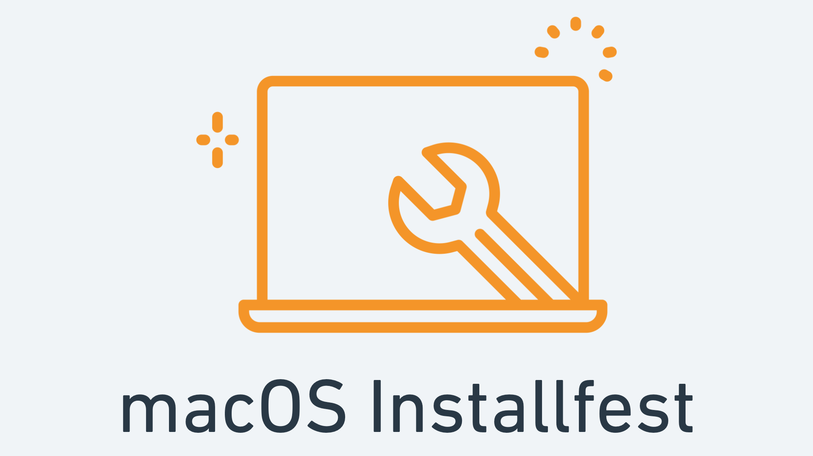

# 



## Python 3

Macs have come with Python 2 pre-installed for quite some time. However, Python 2 is obsolete - we need Python 3!

Python 3 might have been installed by Xcode, let's check by running:

```
python3 --version
```

If you received an error [see below](#Recently-updated-your-MacOs?) or if a version lower than Python 3.8.x is displayed, let's install Python using Homebrew...


### Installing Python 3

Let's have Homebrew install the latest version by running:

```
brew install python@3.11
```

One last step - let's make sure the `python3` command is using Python 3.11:

In `~/.zshrc`, add the following line:

```
export PATH="$(brew --prefix)/opt/python@3.11/libexec/bin:$PATH"
```

You can test the installation by running `python3 --version`.

### Recently updated your MacOs?

`Invalid active developer path` is a common error that occurs when you haven’t agreed to the Xcode Command Line Tools licensing agreement after a macOS update. To solve the issue, install the Command Line Tools package using the command: 

```bash
xcode-select --install.
```

## PostgreSQL

PostgreSQL is a popular and robust Relational Database Management System (RDBMS).

Check if PostgreSQL is already installed by running this command:

```
psql
```

If you entered PostgreSQL's Interactive Shell, you already have PostgreSQL installed. Enter `\q` to exit the shell.

If you already have PostgreSQL installed, note the version and inform an instructor if it's not at least version 10.

Otherwise, let's use Homebrew once again...

### Install PostgreSQL

Install PostgreSQL using Homebrew with this command:

```
brew install postgresql@15
```

After Postgres is installed run this command:

```
brew services restart postgresql@15
```

Then run the following command to create a new database named the same as the current system user:

```
psql template1
```

In psql shell, `run CREATE DATABASE <your computer username exactly as it's written>;` <-this `;` is very important

## Installing Django in a virtual environment

### What is a Virtual Environment?

A virtual environment is a self-contained directory that contains a Python interpreter along with all the libraries and dependencies needed for a particular project. It allows you to isolate your project's dependencies from other projects on your system, preventing conflicts between different versions of the same library and ensuring that your project runs consistently across different environments.

### How Virtual Environments Work with Django:

Django is a powerful web framework for building web applications using Python. When developing Django applications, you often need to install additional packages and libraries to extend its functionality. Virtual environments provide a clean and isolated environment where you can install these dependencies without affecting other projects or the system-wide Python installation.

### By creating a virtual environment for each Django project, you can:

- Install Django and its dependencies locally within the environment.
- Install additional packages required for your project, such as database drivers, middleware, or third-party apps.
- Ensure that your project remains compatible with specific versions of Django and other dependencies.
- Easily manage and update dependencies without worrying about conflicts with other projects.

### Creating a virtual environment

Make sure that pip is installed (this package is automatically installed with Python):

```bash
pip --version
```

Install Virtualenv using pip:

```bash
pip install virtualenv
```

Navigate to the directory where you want to create your project.

Create a new directory for a test project (optional):

```bash
mkdir my_test_project
cd my_test_project
```

Create a virtual environment inside your project directory:

```bash
virtualenv venv
```

Activate the virtual environment:

```bash
source venv/bin/activate
```

You'll notice your terminal prompt changes to show the active environment.

Now you can install Django or any other dependencies you need within this environment using pip.

To deactivate the virtual environment when you're done, simply type:

```bash
deactivate
```