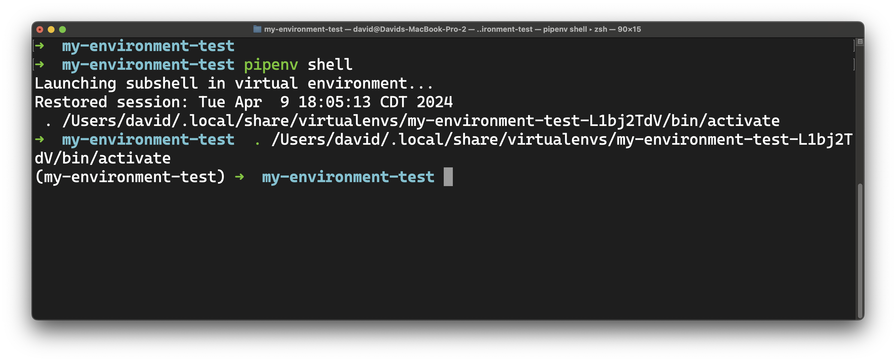
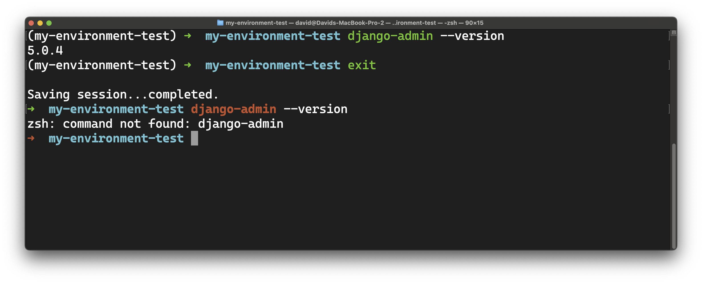

# 

## What you need to begin

- ***A device running macOS 14 Sonoma or macOS 13 Ventura.***
- A user account with administrative privilege to your local installation of macOS.
- The Homebrew package manager is installed.

## Python

Python is an extremely popular programming language with a simple syntax. It is a natural choice for developers to have in their toolbox. Python must be installed on your machine to execute programs written with it.

macOS comes with Python 3 pre-installed. However, we want to avoid using the system's built-in version, which can lead to difficult-to-debug errors and potential system issues!

Let's have Homebrew install version 3.11 of Python by running this command in your Terminal application:

```bash
brew install python@3.11
```

This may take a moment.

> 💔 If you encounter any errors, check out the **Handling errors 💔** subsection below. It may not be immediately apparent that an error has occurred by looking at the end of the output - scroll through the entire output of the command and look for any lines that start with red text reading **Error:**. Once you have successfully installed Python, move on with the below steps.

One last step - let's use this command in the Terminal to make sure the `python` and `python3` commands are using the version of Python that Homebrew just installed:

```bash
cat << EOF >> ~/.zshrc

export PATH="$(brew --prefix python)/libexec/bin:\$PATH"
EOF
```

There is no output from this command.

***Close the Terminal application entirely after running this command.***

***Open the Terminal application.***

### Test the installation

Test your Python installation by running the below commands in your Terminal.

#### `python3` version

```bash
python3 --version
```

This command should output a version number ***starting*** with `Python 3.11`.

#### `python3` directory

```bash
which python3
```

This command should output a file path ***ending*** with `/python@3.11/libexec/bin/python3`

#### Next steps

Continue to the **PostgreSQL** section below if you don't have any errors or discrepancies.

If you have errors, reach out to your instructor for assistance.

### Handling errors 💔

#### Install errors

You may receive the following error after running `bash install python@3.11`:

```plaintext
Error: python@3.11: the bottle needs the Apple Command Line Tools to be installed.
  You can install them, if desired, with:
    xcode-select --**install**
```

You may see this error even if you have previously installed the Apple Command Line Tools. This error also occurs when you haven't agreed to the Xcode Command Line Tools licensing agreement after a macOS update. Regardless, the fix is the same - run the command they suggest in your Terminal:

```bash
xcode-select --install
```

Retry the installation after running this command and following the prompts.

#### Other errors

Contact your instructor for assistance if you encounter other errors while installing Python.

## PostgreSQL

PostgreSQL is a popular and robust Relational Database Management System (RDBMS).

Install PostgreSQL version 16 using Homebrew with this command in your Terminal:

```bash
brew install postgresql@16
```

To ensure you can access the `psql` command, run this command:

```bash
brew link postgresql@16
```

Start the Postgres service with this command:

```bash
brew services start postgresql@16
```

Then, run the following command to create a new database named the same as the current system user. This will ensure that all `psql` commands work as intended:

```bash
createdb
```

To exit the `psql` shell run:

```bash
\q
```

## Installing Pipenv to use virtual environments

### What is a virtual environment?

A virtual environment is a self-contained directory that you create using a tool like Pipenv, which contains a Python interpreter and all the libraries and dependencies needed for a particular project.

It allows you to isolate your project's dependencies from other projects on your system, preventing conflicts such as different versions of the same library used in different projects and ensuring that your project runs consistently across different environments.

Virtual environments provide a clean and isolated environment where you can install these dependencies without affecting other projects.

By creating a virtual environment for each project, you can:

- Install dependencies locally within the environment.
- Install additional packages required for your project, such as database drivers, middleware, or third-party packages.
- Ensure your project remains compatible with specific versions frameworks and other dependencies.
- Easily manage and update dependencies without worrying about conflicts with other projects.

### Install Pipenv

Install [Pipenv](https://pypi.org/project/pipenv/) using pip:

```bash
pip install pipenv --user
```

If you encounter any errors, check out the **Handling errors 💔** subsection below. Otherwise, continue to the **Add Pipenv to your PATH** section.

#### Handling errors 💔

You may encounter an error that starts with the following text:

```plaintext
error: externally-managed-environment
```

If this is the case, use this command to install Pipenv instead:

```bash
pip install pipenv --user --break-system-packages
```

If you still have an error or encounter any other error, reach out to your instructor for assistance.

### Add Pipenv to your PATH

Run this command in your Terminal so that you can run `pipenv`:

```bash
cat << EOF >> ~/.zshrc

export PATH="$(python3 -m site --user-base)/bin:\$PATH"
EOF
```

There is no output from this command.

***Close the Terminal application entirely after running this command.***

***Open the Terminal application.***

Confirm that `pipenv` was installed correctly with this command in your Terminal:

```bash
pipenv --version
```

If this doesn't return a version number, contact your instructor for assistance.

## Creating a virtual environment (demo)

You don't need to do this now, but below are details about how you create virtual environments that use Django. Feel free to skip this, just read through it, or run these commands!

> 🧠 This does not install Django globally on your machine - it is a demo of what you will do for each Django project you create. You do not need to do any of the following to complete the installfest. If you have gotten this far, you've installed everything you need to install, this is just a demo so you can get practice.

Navigate to the directory where you want to create your project - we'd recommend `~/code/ga/lectures`.

Create a new directory for a test project:

```bash
mkdir my-environment-test
cd my-environment-test
```

Initialize a new virtual environment inside your project directory:

```bash
pipenv install django
```

This may take a moment and appear as if nothing is happening; give it some time.

This command will create a new `Pipfile` and `Pipfile.lock` in your project directory, specifying Django as a dependency.

Activate the pipenv shell:

```bash
pipenv shell
```

This will activate the virtual environment and change your terminal prompt to indicate that you are now working within the pipenv shell.



Verify the installation:

```bash
django-admin --version
```

When you're done working on your project, you can deactivate the pipenv shell by typing:

```bash
exit
```

Note that if you run the `django-admin --version` command again, you'll receive a message that it's not installed. Packages only work within the environment they were installed in!


