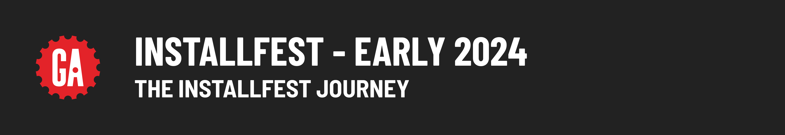

# 

tktk Hunter, this hero needs updated.

It's time for a round of installfest with Python, Postgres, and Django!

To help you through the installfest process, we've included this handy guide that walks you through the individual steps so that you can be sure you're not missing anything along the way. Follow the process outlined below to guide you through this process.

## 1. Install software for your OS

The installfest content is found within these OS-specific guides that will walk you through a setup process tailored to your OS. ***Make sure you only follow one path! Do not open the installfest documents for any OS other than the one you want to set up.***

- macOS
- Windows 10 / Windows 11 / Ubuntu - These operating systems all use the same installfest steps, and documentation.

### What are we installing?

The installfest resources in this module will guide you through installing or configuring the following applications, **regardless of your operating system**:

- Python 3.12
- PostgreSQL
- Django

## 2. Additional installfest material provided by your instructor

If your instructor has any tools they would like you to install, you'll tackle those last. Those documents will be provided by them directly.

## 3. Celebrate, you're done! 🎉
